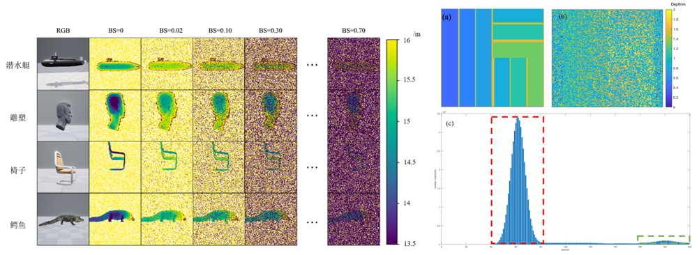

# Simulating-single-photon-detector-array-sensors-for-depth-imaging
This is a official repo for paper *A Simulation Method for Underwater SPAD Depth Image Datasets*. The method is based on *Simulating single-photon detector array sensors for depth imaging* by Stirling Scholes

In our work, we manupulated 20 different target in UE5, and conducted depth image simulating to get over 2000 frames in different backward scattering coefficient. What's more, it is also make sense to get the histogram data, which is formated as .mat file.
Some of the results are shown as below:

**Environment:**
conda create -n simulation python=3.9
conda activate simulation
pip install -r requirement.txt

**Raw Data:**
The raw data output by UE5 are .EXR format, and the 20 group of targets are included in folder “raw_data”. Of course you need to unzip the "raw_data.zip" file.

**Run**
python fisher_my.py
python binomial_my.py
